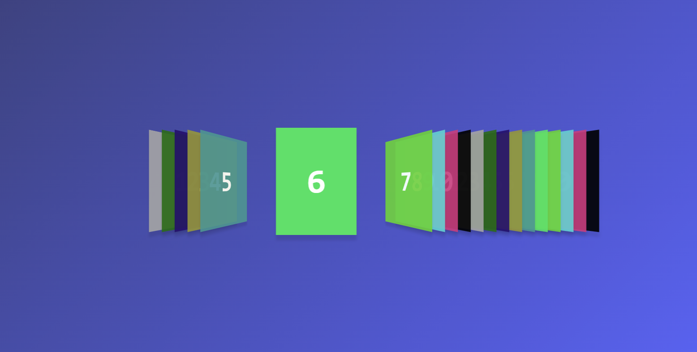

# 3D Card Slider with jQuery and CSS3

## Introduction
This project demonstrates a 3D Card Slider implemented using jQuery and CSS3. The slider features a smooth 3D perspective effect with cards that can be navigated left and right.

## Features
- 3D perspective card slider effect using CSS3 transforms.
- Navigation arrows to slide cards left or right.
- Smooth transition animations.
- Copy source code button with clipboard functionality.
- Responsive design with gradient background.

## Usage Instructions
To use the 3D Card Slider, open the HTML file in a modern web browser. Use the left and right arrows to navigate through the cards.

Click the 'Copy' button below the source code to copy the entire HTML source code to your clipboard.

## Dependencies
- jQuery 3.6.0 (loaded from CDN)
- Font Awesome 4.7.0 for navigation icons (loaded from CDN)
- SweetAlert2 for alert messages (loaded from CDN)

## Screenshot
Below is a screenshot of the 3D Card Slider in action.

